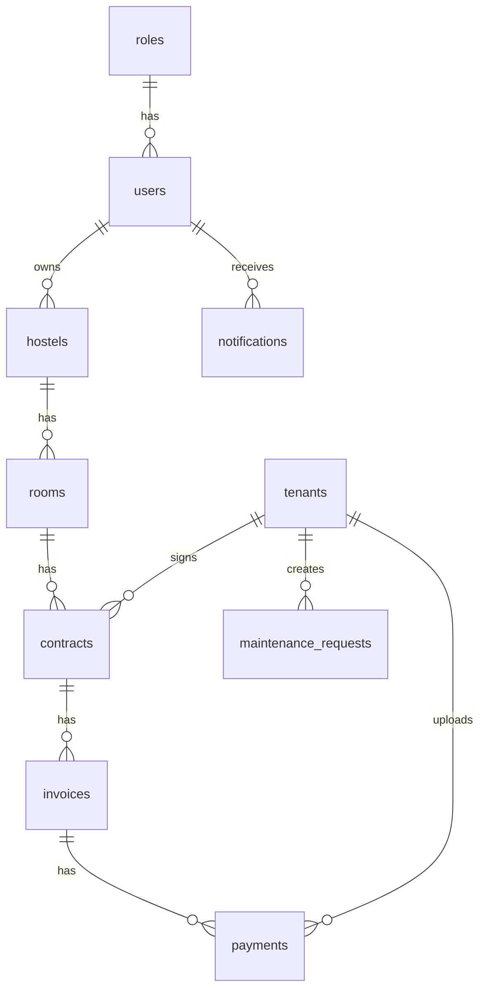

# Database design - Quản lý khu trọ

## ERD (rút gọn)

## Quan hệ chính
- `contracts.room_id` + `status=active` đảm bảo business rule một phòng một hợp đồng hiệu lực.
- `invoices` lưu chỉ số điện/nước và tổng tiền đã tính.
- `payments` lưu proof + trạng thái xác nhận thủ công (`pending|paid|rejected`).
- `maintenance_requests` workflow (`pending|processing|done`).

## Bảng cốt lõi
- users, roles
- hostels, rooms, tenants
- contracts
- invoices
- payments
- maintenance_requests
- notifications

Chi tiết SQL hoàn chỉnh nằm tại `database/schema.sql`.
